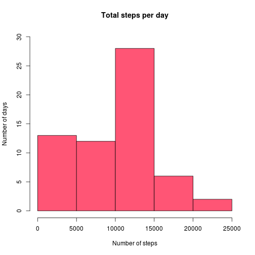
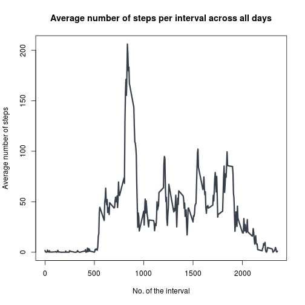
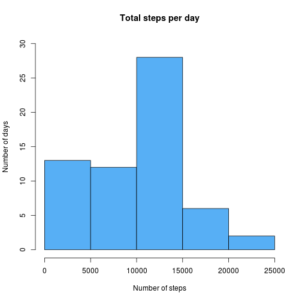
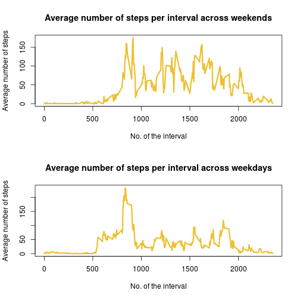

# Reproducible Research: Peer Assessment 1
This report should demostrate the basic possibilities of integrating R code with
comments through knitr. Since each step should be composed of both code and its
description, there are some duplicities in the functions so as to avoid
cross-references. In production code, the duplicated code would be removed by
auxillary methods.

## Loading and preprocessing the data

The *unzip* function is used to extract the data file to a temporary directory
created by *tempdir* function (the directory will be automatically deleted by 
the anonymous function *on.exit*). Once the *activity.csv* file is extracted,
it is loaded by *read.csv* function. The code assumes the archive with the
original data to be placed in the current working directory.

```r
# create the temporary directory
tmpDir = tempdir();
# ensure it's deleted when the script is finished
on.exit(function() unlink(tmpDir, TRUE, TRUE));
# ensure it really was created (sometimes help on Debian-based distros)
dir.create(tmpDir, recursive=TRUE, showWarnings=FALSE);

# unzip the file to the temporary directory
unzippedDir = file.path(tmpDir, "unzipped");
dir.create(unzippedDir, showWarnings=FALSE);
unzip(zipfile="./activity.zip",exdir=unzippedDir);

# read the file
filePath = file.path(unzippedDir, "activity.csv");
movements = read.csv(filePath,
                     header = TRUE,
                     sep = ",",
                     quote = "\"",
                     comment.char = "",
                     stringsAsFactors = FALSE,
                     colClasses = c("integer", "Date", "integer"));
```


## What is mean total number of steps taken per day?
The histogram shows the total number of steps taken per day. The total number
of steps per day is summed up, ignoring all the missing values. The Freedman-
Diaconis rule is used for computing the breaks.

```r
stepsPerDay = sapply(split(movements$steps, movements$date),
                     sum,
                     na.rm = TRUE);
hist(stepsPerDay,
     main = "Total steps per day",
     xlab = "Number of steps",
     ylab = "Number of days",
     breaks = "fd",
     ylim = c(0, 30),
     col = "#FF5575");
```

 

The mean and median values of total numner of steps per day are also calculated 
disregard of all the *NA* values.

```r
# force autoprint and assignment on one row
(mean0 = mean(stepsPerDay));
```

```
## [1] 9354
```

```r
(median0 = median(stepsPerDay));
```

```
## [1] 10395
```


## What is the average daily activity pattern?
The graph below depicts the average number of steps taken across all of the days
at the particular 5-minute interval.

```r
avgStepsInterval = sapply(split(movements$steps, movements$interval),
                          mean,
                          na.rm = TRUE);

plot(avgStepsInterval ~ levels(factor(movements$interval)), 
     type = "l",
     main = "Average number of steps per interval across all days",
     xlab = "No. of the interval",
     ylab = "Average number of steps",
     col = "#373F4A",
     lwd = 3);
```

 

The number of the interval with highest average value of steps taken across all
of the days and the actual maximum value:

```r
avgStepsInterval[avgStepsInterval == max(avgStepsInterval)];
```

```
##   835 
## 206.2
```

## Imputing missing values
The total number of rows with at least one missing value:

```r
# use the underlying representation of logical vector, 0 for FALSE, 1 for TRUE
nrow(movements) - sum(complete.cases(movements));
```

```
## [1] 2304
```

Fill the missing values with the average number of steps taken during the period
at other days.

```r
fillAvgInterVal = function(mat) {
  stepCol = avgStepsInterval[mat[,"interval"]];
  
  for(i in which(!complete.cases(movements))) {
    mat[i,]["steps"] = stepCol[i];
    }
  mat
  }
```

Use the code above to create a new data set with the missing values filled
in.

```r
filledMov = fillAvgInterVal(movements);
```

Once again calculate the total sum of steps per day with the missing values
filled in.

```r
fstepsPerDay = sapply(split(filledMov$steps, filledMov$date),
                      sum,
                      na.rm = TRUE);

hist(fstepsPerDay,
     main = "Total steps per day",
     xlab = "Number of steps",
     ylab = "Number of days",
     breaks = "fd",
     ylim = c(0, 30),
     col = "#57AFF5");
```

 

New mean and median values:

```r
(mean1 = mean(fstepsPerDay))
```

```
## [1] 9522
```

```r
(median1 = median(fstepsPerDay))
```

```
## [1] 10395
```


As one can see the difference between means is 167.4912 and the difference
between medians is 0. Difference between means should be smaller
since median is much more robust statistic than mean. The difference between
the total number of steps per days is 167.4912.

## Are there differences in activity patterns between weekdays and weekends?

A new column containing flag value identifiyng weekends is appended to the frame
with *NA* values filled in.

```r
filledMov$weekend = weekdays(filledMov$date) %in% c("Saturday", "Sunday");
```

Use the new column's values to plot graph comparing the activity on weekends
against the activity on weekdays.

```r
weekends = filledMov[filledMov$weekend,];
fAvgStepsIntervalEnd = sapply(split(weekends$steps,
                                    weekends$interval),
                              mean,
                              na.rm = TRUE);
weekdays = filledMov[!filledMov$weekend,];
fAvgStepsIntervalDay = sapply(split(weekdays$steps,
                                    weekdays$interval),
                              mean,
                              na.rm = TRUE);

par(mfrow = c(2,1));
plot(fAvgStepsIntervalEnd ~ levels(factor(filledMov$interval)), 
     type = "l",
     main = "Average number of steps per interval across weekends",
     xlab = "No. of the interval",
     ylab = "Average number of steps",
     col = "#EEC030",
     lwd = 3);
plot(fAvgStepsIntervalDay ~ levels(factor(filledMov$interval)), 
     type = "l",
     main = "Average number of steps per interval across weekdays",
     xlab = "No. of the interval",
     ylab = "Average number of steps",
     col = "#EEC030",
     lwd = 3);
```

 
